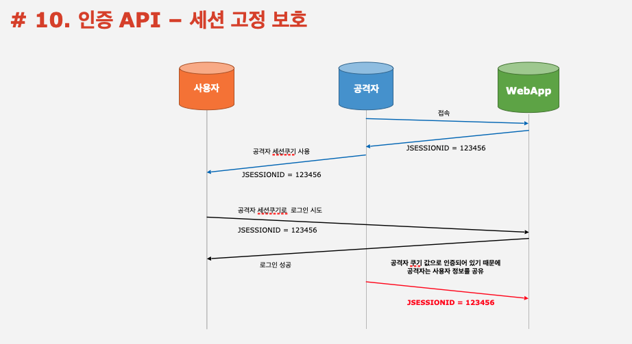

# 스프링 시큐리티 - Spring Boot 기반으로 개발하는 Spring Security

# 01. 인증 API - 스프링 시큐리티 의존성 추가
- `스프링 시큐리티의 의존성 추가 시 일어나는 일들`
  - 서버가 기동되면 스프링 시큐리티의 초기화 작업 및 보안 설정이 이루어진다.
  - 별도의 설정이나 구현을 하지 않아도 `기본적인 웹 보안 기능이 현재 시스템에 연동`되어 작동한다.
    1. 모든 요청은 인증이 되어야 자원에 접근이 가능하다.
    2. 인증 방식은 폼 로그인 방식과 httpBasic 로그인 방식을 제공한다.
    3. 기본 로그인 페이지를 제공한다.
    4. 기본 계정 한 개를 제공한다. - username : user / password : 랜덤 문자연

- `문제점`
  - 계정 추가, 권한 추가, DB 연동 등
  - 기본적인 보안 기능 외에 시스템에서 필요로 하는 더 세부적이고 추가적인 보안기능이 필요   
   
   
# 02. 스프링 시큐리티 Override 하여 직접 설정하는 방법

1. `WebSecurityConfigurerAdapter` 를 상속받는다.
2. `protected void configure(HttpSecurity http) throws Exception` 를 `Override` 한다.
3. 인증
```
http.authorizeRequests()
			.anyRequest()
			.authenticated();
```
4. 인가
```
http.formLogin();
```

## 02-1. 간단한 클래스 설명
- `WebSecurityConfigurerAdapter`
  - 스프링 시큐리티의 웹 보안 기능 초기화 및 설정
  - 상속받아서 사용자 정의 보안 설정 클래스를 만든다.
- `HttpSecurity`
  - 세부적인 보안 기능을 설정할 수 있는 API 제공
  - `configure` 메소드의 인수 값

# 03. Login 동작 원리

  

# 04. Logout 동작 원리


# 05. 인증 API - Remember Me 인증
1. 세션이 만료되고 웹 브라우저가 종료된 후에도 어플리케이션이 사용자를 기억하는 기능
2. Remember-Me 쿠키에 대한 Http 요청을 확인한 후 토큰 기반 인증을 사용해 유효성을  
   검사하고 토큰이 검증되면 사용자는 로그인 된다.
3. 사용자 라이프 사이클
    - 인증 성공 (Remember-Me 쿠키 설정)
    - 인증 실패 (쿠키가 존재하면 쿠키 무효화)
    - 로그아웃 (쿠키가 존재하면 쿠키 무효화)


# 06. 인증 API - AnonymousAuthenticationFilter


# 07. 동시 세션 제어, 세션 고정 보호, 세션 정책


